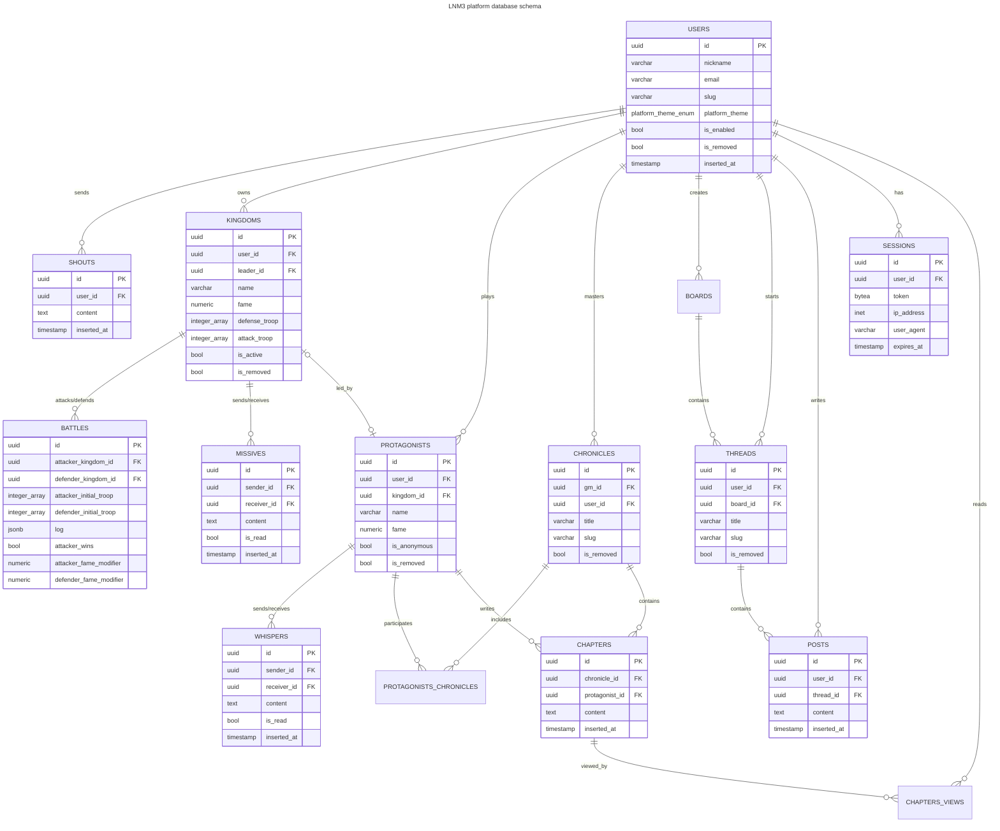

# LNM3

> **Note**
> 
> While _Le Nouveau Monde_’s community is french speaking, let’s
> keep the codebase in english by convention.

LNM rebirth. (:

Historcally a PHP project, this rebirth runs on an
Elixir/Phoenix/PostgreSQL backend (REST API), a Nuxt
frontend, and some PHP/Symfony to serve the legacy
forum archives.

---

## Project technical overview

### Project structure

```directory
lnm3/
├── .env.example                # Example environment variables
├── docker-compose.yml          # Local development orchestration
├── Makefile                    # Makefile for local development
├── infrastructure/
│   ├── database/               # PostgreSQL database 
│   └── reverse_proxy/          # Traefik reverse proxy
└── services/
    ├── archive/                # Archive API (PHP/Symfony/SQLite)
    ├── frontend/               # Nuxt frontend (Bun runtime)
    └── platform/               # Platform API (Elixir/Phoenix/PostgreSQL)
```

All bricks in `infrastructure/` and `services/` have Dockerfiles.

Depending on the final deployment target, `infrastructure/` might
not be handled through Docker though. At this stage of the project,
LNM3 will likely be deployed on an OVH VPS under Coolify, so only
`services/` would be containerized in this scenario.

### Networking & routing

Traefik is used as reverse proxy.

Internal communications follow this schema:

```
Traefik
├── domain.example ───────────── lnm3_frontend:3000   # Frontend app
├── platform.domain.example ──── lnm3_platform:4000   # Platform API
    └── lnm3_database:5432                            # Postgres DB
└── archive.domain.example ───── lnm3_archive:9000    # Archive API
```


The database communicates only with the Platform service through
a shared `database_network`. It is isolated from the reverse
proxy’s `front_network` and the external world.

So services are accessed through the following URLs:

| Service          | URL                             | Description                       |
|------------------|---------------------------------|-----------------------------------|
| **Frontend**     | https://www.domain.example      | Nuxt frontend application         |
| **Platform API** | https://platform.domain.example | Phoenix API backend               |
| **Archive API**  | https://archive.domain.example  | Legacy forum archives (read-only) |

In development environment, the following URLs should work by
default:

- http://localhost
- http://platform.localhost
- http://archive.localhost
- http://localhost:8080/dashboard

Maybe check your `/etc/hosts` if something doesn’t work as expected.

> **Note**
> 
> While the two REST APIs (Platform and Archive) are openly exposed
> to the world – and are meant to be that way –, in reality they act
> as a backend and will be mostly consumed by the frontend. I don’t
> expect that much direct traffic to them.

> **Note**
> 
> Traefik exposes its `localhost:8080/dashboard` in the `dev`
> Docker stage **only**.
> 
> This is obviously not to be deployed in production.

---

### Database structure



Some points:
- Keys are UUIDv7 generated in code.
- Passwords use Argon2id hash.

## Development

### Prerequisites

- `docker` & `docker compose`
- `make`

### Setup

The following command should put you on the rails with
the whole default dev environment:

```bash
make setup
```

It will copy the `.env.example` file into a newly
created `.env`. You can customize it if needed, `docker compose`
will read it.

### Git worklow

`master` is the main branch. It should be stable and tested.
It receives PRs from development sub-branches or forks.

When a release is ready, `master` is merged into `release` with
`--no-ff`, and that merge commit is tagged with a version number
following [SemVer](https://semver.org/) convention.

```text
release  ________*(v1.2.0)___________*(v1.2.1)_______*(v1.2.2)__
                /                   /               /
master   ______*_____*_____________*_______*_______*____________
              / \   /             /       / \     /
feature  ____/   \_/             /       /   \___/
                                /       /
hotfix   ______________________/_______/
```

## Production Deployment

🚧 Todo

## License

[GNU GPL v3](LICENSE)
